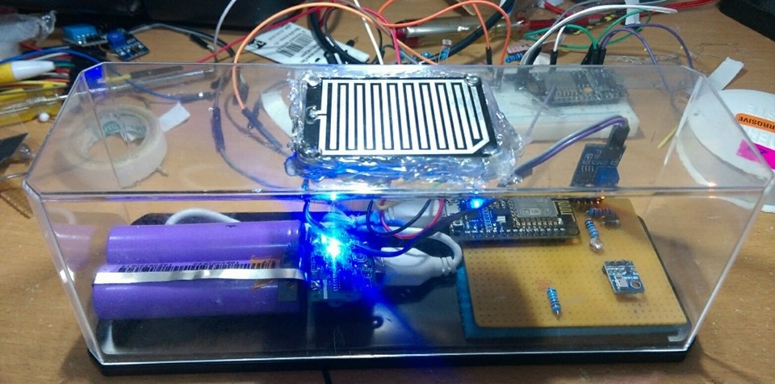
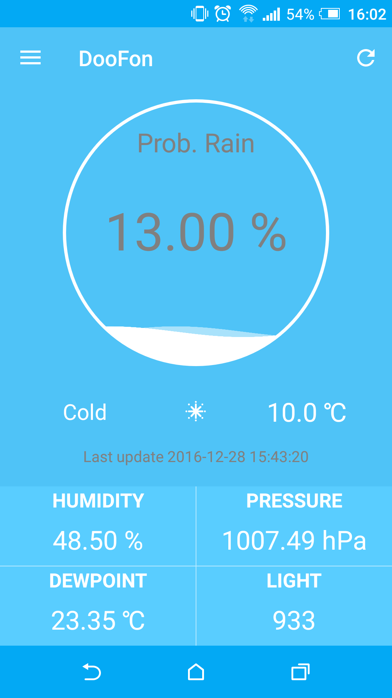
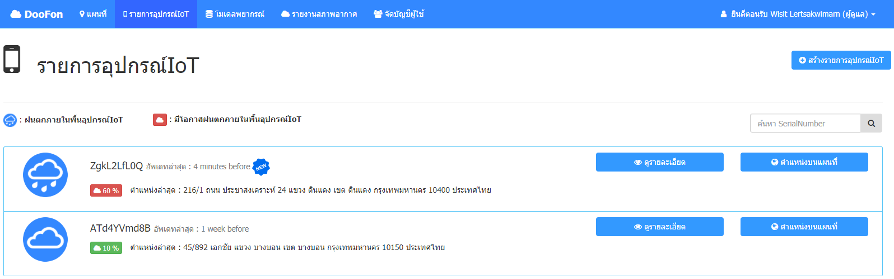
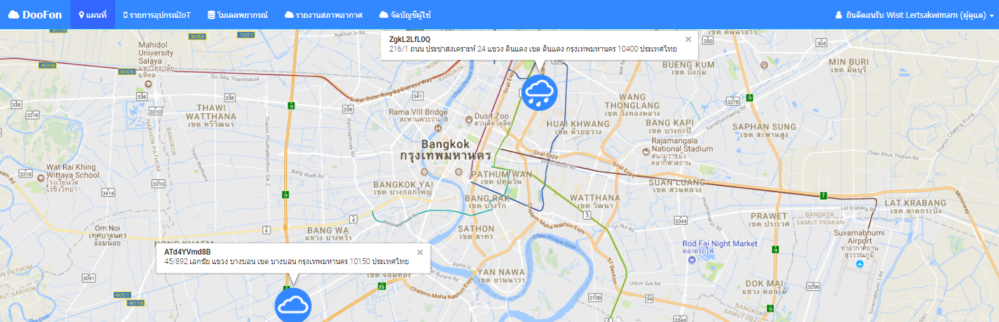

# DooFon:  Local rain forecast system (IoT)

### Highlight 
> **A local rain detection algorithms based on classification algorithms by data mining**

   The system is designed to be utilized to detect current weather and rain forecast advance. In our system, Barometric pressure sensor, Humidity sensor, Thermistor, Light Sensor and etc are IoT device and it continuously submit their measurements to our doofon management system. 
### Important Features

1. Local Weather -- display the local weather of IoT device updated every 5 minutes
    * Atmospheric pressure (hPa)
    * Temperature (degree Celsius)
    * Humidity (percent %)
    * Dewpoint (degree Celsius)
    * Light (illuminance or lux)
    * Rain Detection
2. Local Rain Detection 
    * detect an rain in 2 hour advance and display the detail of the raindrop for IoT device 
    * detect current rain for IoT device 
3. Raindrop monitoring 
    * monitor the current rain of IoT device and sent instant notifications in case of raindrop
    * monitor the rain forecast and sent instant notifications in case of rain forecast are more than or equal to user-defined values.
4. Weather History - view the weather history of IoT device (maximum fourteen-day period)

### Architecture for DooFon:  Local rain forecast system (IoT)
 

### Sample system

#### IoT Device
 

#### Mobile App 
 

#### Web 
 
 
 

