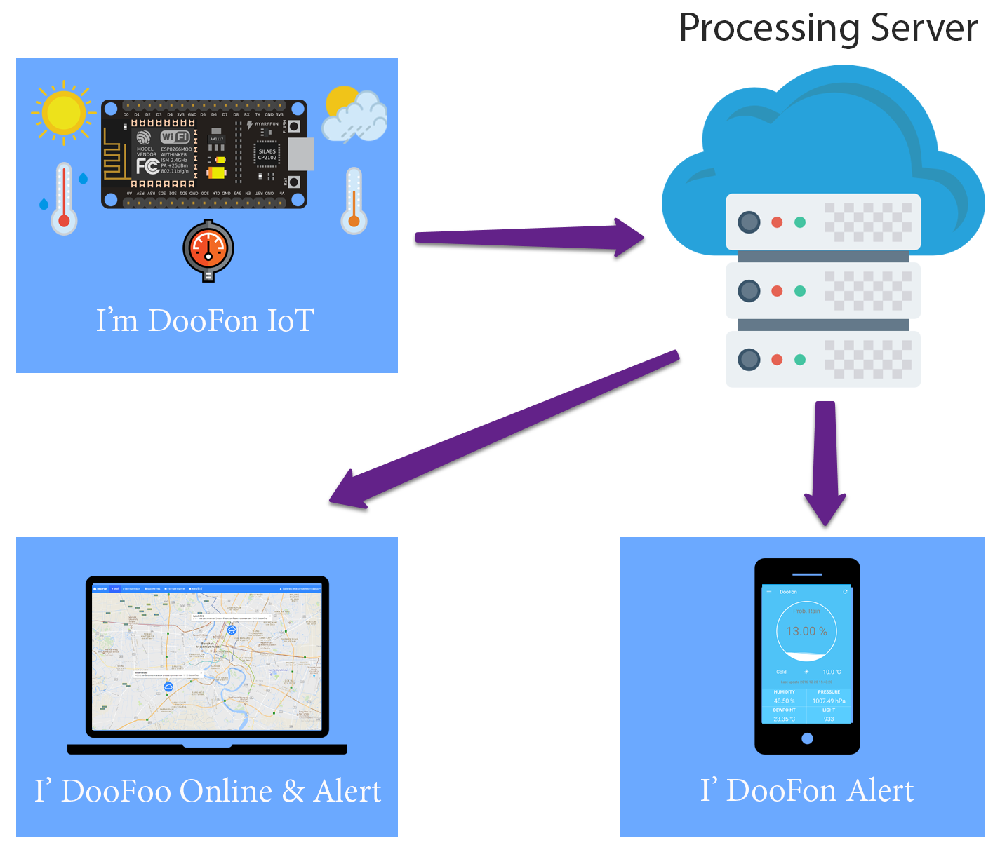
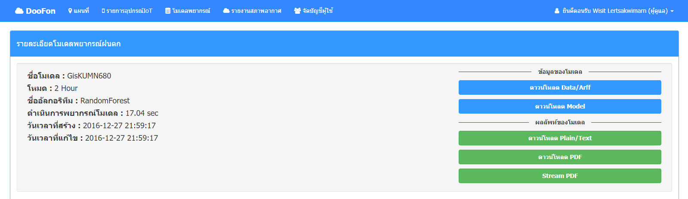

# ดูฝน: ระบบพยากรณ์ฝนตกเฉพาะที่ (IoT)

### Highlight 
> ** อัลกอริทึมการตรวจจับพยากรณ์ฝนโดยใช้อัลกอริทึมจำแนกประเภท Random forests (Random decision forests)

ระบบนี้ได้รับการออกแบบเพื่อใช้ในการตรวจจับสภาพอากาศในปัจจุบันและการคาดการณ์พยากรณ์ฝนตกล่วงหน้า ในระบบประกอบไปด้วย
เซ็นเซอร์หลายตัว เช่น เซ็นเซอร์วัดความกดอากาศ, เซ็นเซอร์วัดความชึ้นและอุณหภมูิ, เซ็นเซอร์วัดความแสง เป็นต้น ประกอบรวมกันเรียกว่า อุปกรณ์ IoT ตรวจวัดสภาวะอากาศ 
ทำการตรวจวัดและส่งข้อมูลไปยังระบบจัดการดูฝนอย่างโดยต่อเนื่อง

### คุณลักษณะสำคัญ

1. สภาวะอากาศเฉพาะที่ -- แสดงสภาวะอากาศของอุปกรณ์ IoT โดยอัพเดททุกๆ 5 นาที่
     * ความกดอากาศ (hPa)
     * อุณหภูมิ (องศาเซลเซียส)
     * ความชื้น (เปอร์เซ็นต์)
     * จุดน้ำค้าง (องศาเซลเซียส)
     * แสง (illuminance or lux)
     * การตรวจจับสายฝน
2. การตรวจจับพยากรณ์ฝนเฉพาะที่
     * ตรวจจับพยากรณ์ฝนล่วงหน้า 2 ชั่วโมงและแสดงรายละเอียดของการตรวจจับ
     * ตรวจจับฝนในปัจจุบัน
3. การตรวจสอบและติดตามฝนตก
     * ตรวจสอบและติดตามฝนตกในปัจจุบัน และส่งการแจ้งเตือนแบบทันทีในกรณีที่ฝนตก
     * ตรวจสอบและติดตามฝนตกล่วงหน้า 2 ชั่วโมง และส่งการแจ้งเตือนแบบทันทีในกรณีที่ ค่าพยากรณ์โอกาสที่ฝนจะตก มีค่ามากกว่าหรือเท่ากับค่าที่ผู้ใช้ตั้งค่าไว้
4. ประวัติสภาวะอากาศ - ดูประวัติสภาพอากาศของอุปกรณ์ IoT ย้อนหลัง

### สถาปัตยกรรมของ ดูฝน: ระบบพยากรณ์ฝนตกเฉพาะที่ (IoT)
 

### ตัวอย่างระบบ

#### ** ตัวอย่าง ** อุปกรณ์ IoT ตรวจวัดสภาวะอากาศ
 

#### ** ตัวอย่าง ** แอพพลิเคชั่นบนสมาร์ทโฟนสำหรับระบบปฏิบัติการแอนดรอยด
 

#### ** ตัวอย่าง ** เว็บไซต์
 
 
 
